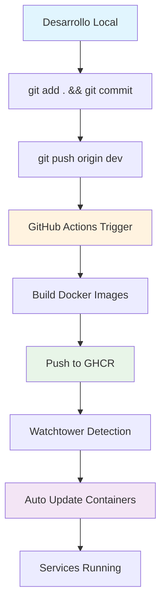
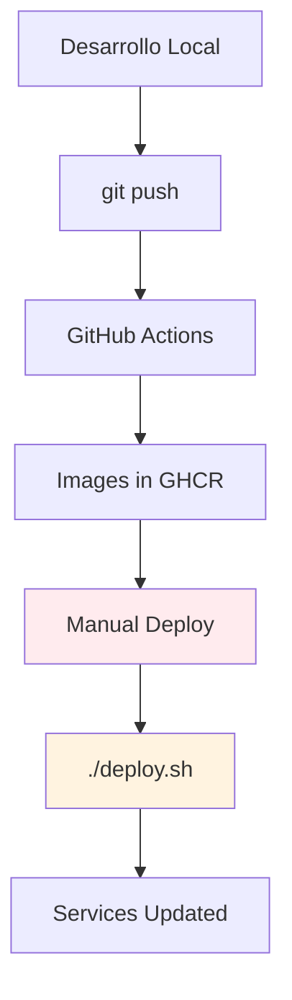

# Flujo CI/CD Completo - HJM

## 🚀 Resumen del Flujo de Despliegue Automatizado

### Flujo Principal (Automático)



### Flujo Alternativo (Manual)



## 📋 Detalles del Flujo

### 1. Desarrollo y Commit

```bash
# En tu máquina local
git add .
git commit -m "feat: nueva funcionalidad"
git push origin dev
```

### 2. GitHub Actions (Automático)

**Archivo**: `.github/workflows/deploy.yml`

**Proceso**:

- ✅ Detecta push en branch `dev`
- ✅ Construye imágenes Docker para:
  - `cagpu-frontend`
  - `cagpu-backend`
  - `mau-frontend`
  - `mau-backend`
- ✅ Publica en GHCR con tags:
  - `latest` (para desarrollo)
  - `v1.0.0` (para releases)
- ✅ Ejecuta tests si están configurados

**Tiempo estimado**: 5-10 minutos

### 3. Publicación en GHCR

**Ubicación**: `ghcr.io/tu-usuario/hjm-*`

**Imágenes generadas**:

- `ghcr.io/tu-usuario/cagpu-frontend:latest`
- `ghcr.io/tu-usuario/cagpu-backend:latest`
- `ghcr.io/tu-usuario/mau-frontend:latest`
- `ghcr.io/tu-usuario/mau-backend:latest`

### 4. Watchtower (Automático)

**Configuración**: Cada 60 segundos

**Proceso**:

1. 🔍 Escanea GHCR en busca de nuevas imágenes
2. 🏷️ Identifica contenedores con label `com.centurylinklabs.watchtower.enable=true`
3. 📥 Descarga nuevas imágenes
4. 🔄 Reinicia contenedores automáticamente
5. 🧹 Limpia imágenes antiguas

**Tiempo de detección**: Máximo 60 segundos

### 5. Despliegue Manual (Opcional)

```bash
# En el servidor
cd /opt/hjm-deployment
./deploy.sh
```

**Opciones disponibles**:

```bash
./deploy.sh                    # Despliegue completo con confirmación
./deploy.sh --force           # Despliegue sin confirmación
./deploy.sh --service cagpu-frontend  # Solo un servicio
./deploy.sh --logs            # Despliegue + mostrar logs
```

## ⚙️ Configuración Requerida

### En el Servidor Ubuntu

#### 1. Docker Compose con Watchtower

```yaml
services:
  # Tus servicios existentes...

  watchtower:
    image: containrrr/watchtower:latest
    container_name: watchtower
    restart: unless-stopped
    volumes:
      - /var/run/docker.sock:/var/run/docker.sock
    environment:
      - WATCHTOWER_POLL_INTERVAL=60
      - WATCHTOWER_CLEANUP=true
      - WATCHTOWER_INCLUDE_STOPPED=true
      - WATCHTOWER_REVIVE_STOPPED=true
    command: --interval 60 --label-enable
    labels:
      - "com.centurylinklabs.watchtower.enable=true"
```

#### 2. Labels en Servicios

Cada servicio debe tener:

```yaml
labels:
  - "com.centurylinklabs.watchtower.enable=true"
```

#### 3. Login en GHCR

```bash
echo "TU_TOKEN_GITHUB" | docker login ghcr.io -u TU_USUARIO_GITHUB --password-stdin
```

## 🔄 Estados del Sistema

### Estado Normal

- ✅ Todos los servicios corriendo
- ✅ Watchtower monitoreando
- ✅ Últimas imágenes desplegadas

### Durante Actualización

- 🔄 Watchtower detecta nueva imagen
- ⏸️ Servicio se detiene temporalmente
- 📥 Nueva imagen se descarga
- ▶️ Servicio se reinicia con nueva imagen
- 🧹 Imagen anterior se elimina

### Estado de Error

- ❌ Servicio no puede iniciar
- 🔄 Watchtower reintenta automáticamente
- 📝 Logs disponibles para debugging

## 📊 Monitoreo y Logs

### Comandos de Monitoreo

```bash
# Estado general
docker compose ps

# Logs en tiempo real
docker compose logs -f

# Logs de Watchtower
docker logs watchtower

# Uso de recursos
docker stats

# Imágenes disponibles
docker images | grep ghcr.io
```

### Logs Importantes

- **Watchtower**: `docker logs watchtower`
- **Servicios**: `docker compose logs [servicio]`
- **Sistema**: `/var/log/syslog`

## 🚨 Troubleshooting

### Problemas Comunes

#### Watchtower no actualiza

```bash
# Verificar logs
docker logs watchtower

# Verificar labels
docker inspect [contenedor] | grep -A 5 Labels

# Reiniciar Watchtower
docker compose restart watchtower
```

#### Servicios no inician

```bash
# Ver logs detallados
docker compose logs [servicio]

# Verificar configuración
docker compose config

# Reiniciar todo
docker compose down && docker compose up -d
```

#### Problemas de permisos

```bash
# Verificar grupo docker
groups $USER

# Agregar usuario al grupo
sudo usermod -aG docker $USER
newgrp docker
```

## 📈 Métricas de Rendimiento

### Tiempos Promedio

- **GitHub Actions**: 5-10 minutos
- **Detección Watchtower**: < 60 segundos
- **Actualización servicio**: 30-60 segundos
- **Tiempo total**: 6-12 minutos

### Disponibilidad

- **Uptime objetivo**: 99.9%
- **Tiempo de inactividad**: < 1 minuto por actualización
- **Rollback automático**: Si nueva imagen falla

## 🔐 Seguridad

### Mejores Prácticas

- ✅ Token GHCR con permisos mínimos
- ✅ Imágenes escaneadas por GitHub
- ✅ Servicios aislados en contenedores
- ✅ Logs centralizados
- ✅ Backup automático de datos

### Rotación de Tokens

```bash
# Generar nuevo token en GitHub
# Actualizar en servidor
echo "NUEVO_TOKEN" | docker login ghcr.io -u USUARIO --password-stdin
```

## 📝 Checklist de Despliegue

### Antes del Primer Despliegue

- [ ] Servidor Ubuntu configurado
- [ ] Docker y Docker Compose instalados
- [ ] Login en GHCR configurado
- [ ] Archivos .env copiados
- [ ] docker-compose.yml configurado
- [ ] Watchtower agregado al compose
- [ ] Labels agregadas a servicios
- [ ] Script deploy.sh con permisos

### Después del Despliegue

- [ ] Todos los servicios corriendo
- [ ] Watchtower funcionando
- [ ] Acceso a aplicaciones verificado
- [ ] Logs monitoreados
- [ ] Backup configurado

## 🎯 Beneficios del Sistema

### Automatización Completa

- ✅ Zero-downtime deployments
- ✅ Rollback automático en caso de error
- ✅ Monitoreo continuo
- ✅ Limpieza automática de recursos

### Flexibilidad

- ✅ Despliegue automático por defecto
- ✅ Despliegue manual cuando sea necesario
- ✅ Actualización de servicios individuales
- ✅ Control granular de actualizaciones

### Monitoreo

- ✅ Logs centralizados
- ✅ Métricas de rendimiento
- ✅ Alertas automáticas
- ✅ Dashboard de estado

¡Con este sistema tendrás un pipeline de CI/CD robusto y completamente automatizado! 🚀
